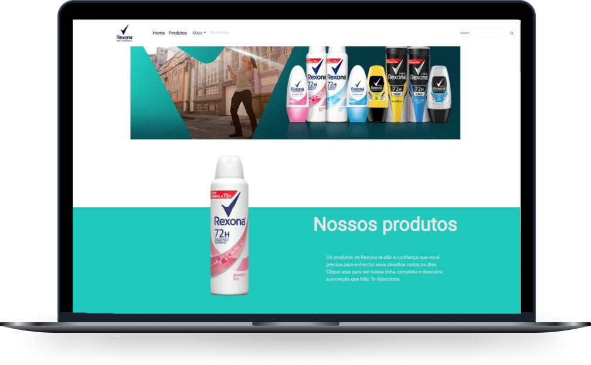
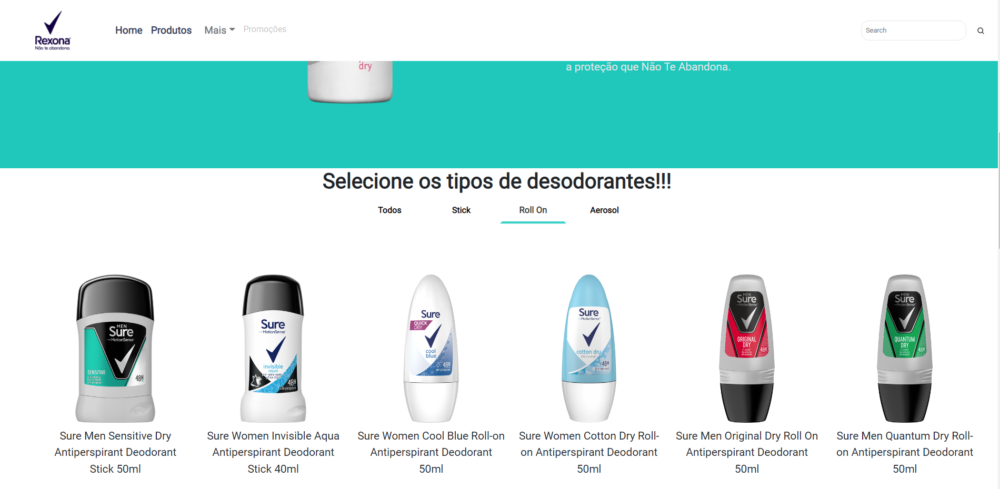
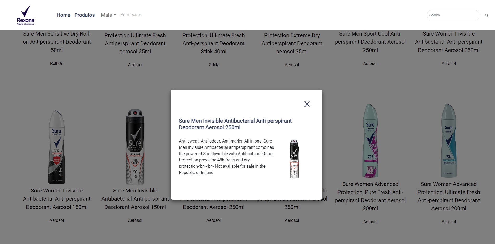
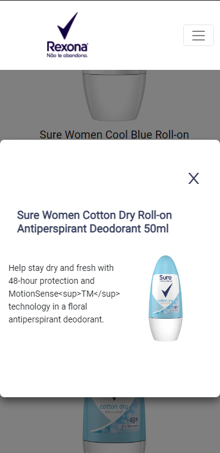

<p align="center">  Produtos Rexona 🚀</p>

<p align="center">
   
</p>

<p align="center">	
   <a href="https://www.linkedin.com/in/lorison-gilles/">
      
   </a>
  

  <a href="https://github.com/Gilles30/sure-rexona/commits/master">
    
  </a> 
  
  <a href="https://github.com/Gilles30/sure-rexona/stargazers">
    
  </a>
</p>

> <p align="center"> :rocket: Project created in carrying out a skill test with web development </p>

<p align="center">
    <a href="README.md">English</a>
    ·
    <a href="README-pt.md">Portuguese</a>
 </p>

<div align="center">
  <sub>Os Produtos Rexona. Construído com ❤︎ por
    <a href="https://github.com/Gilles30">Lorison Gilles</a> e
    <a href="https://github.com/Gilles30/sure-rexona/">
      contribuidores.
    </a>
  </sub>
</div>

# :pushpin: Indice

- [:pushpin: Indice](#pushpin-indice)
    - [Web Screenshot](#web-screenshot)
    - [Mobile Screenshot](#mobile-screenshot)
- [:eyes: Demo Website](#eyes-demo-website)
- [:computer: Tecnologias](#computer-tecnologias)
- [:rocket: Recursos](#rocket-recursos)
- [:construction_worker: Como rodar](#construction_worker-como-rodar)
    - [📦 Rodar API](#-rodar-api)
    - [💻 Rodar Projeto Web](#-rodar-projeto-web)
- [:bug: Problemas](#bug-problemas)
- [:tada: Contribuindo](#tada-contribuindo)
  - [🤝 Contribuindo](#-contribuindo)
- [:closed_book: Licenca](#closed_book-licenca)

</p>

### Web Screenshot

<div align="center">
   
   </br></br>
   
   </br></br>
   <p>
   Os produtos são exibidos em cartões próximos uns dos outros de maneira responsiva e podem ser filtrados por suas categorias.
   </p>
   
   <p>
   A tela de erro foi criada, para que o usuário possa ter uma melhor experiência caso ocorra algum erro nas páginas (como uma rota que não existe), foi colocado uma pequena animação no icone central.
   </p>
   </br></br>
   
   <p>
    Foi criado um modal com mais detalhes do item. Clicar no cardo do item abre o modal e pode ser fechado clicando fora do modal, clicando no botão "fechar" ( X ) e também pressionando esc no teclado
   </p>
   
</div>
</br>

### Mobile Screenshot

<div align="center">
  
  </br></br>
   
   </br></br>
   
</div>

# :eyes: Demo Website

Você pode acessar o site deployado clicando no icone abaixo:
👉 demo:

[](https://sure-rexona.vercel.app/)

# :computer: Tecnologias

Este projeto foi feito utilizando as seguintes tecnologias:

- [Typescript](https://www.typescriptlang.org/)
- [Axios](https://axios-http.com/)
- [Prettier](https://prettier.io/)
- [React](https://reactjs.org/)
- [Styled-Components](https://www.styled-components.com/)
- [Json-server](https://github.com/typicode/json-server)
- [Reactstrap](https://reactstrap.github.io/?path=/story/home-installation--page)
- [Express](https://expressjs.com)

# :rocket: Recursos

- Listagem de produtos.
- Filtragem dos produtos por sua categoria.
- Layout responsivo.
- API para consumo de dados.

# :construction_worker: Como rodar

```bash
# Clonar o repositório
$ git clone https://github.com/Gilles30/sure-rexona.git
```

### 📦 Rodar API

- API API consumed directly from the cloud!

```bash
# Routes and Endpoint
$ api-sure.herokuapp.com/data

# Object Typing
$ Data:{
  nodes
    {
      name: string,
      shortDescription: string
      id: string
      images:
        [
          {
            alt: string
            src: string
          }
        ]
      category:
        [
          name: string
          id: string
        ]
    }
  }
```

Access API at http://api-sure.herokuapp.com/data

### 💻 Rodar Projeto Web

```bash
# Go to web folder
$ cd sure-rexona

# Install Dependencies
$ yarn

# Run Aplication
$ yarn start

```

Go to http://localhost:3000

# :bug: Problemas

Sinta-se à vontade para **arquivar uma nova edição** com o respectivo título e descrição no repositório [Proffy](https://github.com/Gilles30/sure-rexona.git/issues). Se você já encontrou uma solução para o seu problema, **eu adoraria analisar sua solicitação de pull**!

# :tada: Contribuindo

Confira a página [contribuindo](./CONTRIBUTING.md) para ver os melhores lugares para arquivar problemas, iniciar discussões e começar a contribuir.

## 🤝 Contribuindo

Siga os passos abaixo para contribuir:

1.  _fork_ o projeto (<https://github.com/Gilles30/sure-rexona.git>)

2.  Clone seu _fork_ para sua máquina (`git clone https://github.com/Gilles30/sure-rexona.git`)

3.  Crie um _branch_ para realizar sua modificação (`git checkout -b feature/name_new_feature`)

4.  Adicione suas modificações e faça o _commit_ (`git commit -m "Descreva sua modificação"`)

5.  _Push_ (`git push origin feature/name_new_feature`)

6.  Crie um novo _Pull Request_

7.  Pronto, agora é só aguardar a análise 🚀

# :closed_book: Licenca

Lançado em 2022 :closed_book: Licença

Feito com amor por [Lorison Gilles](https://lorison-gilles.netlify.app/) 🚀.
Este projeto está sob a [MIT license](./LICENSE).

Dê um ⭐️ se esse projeto te ajudou!
