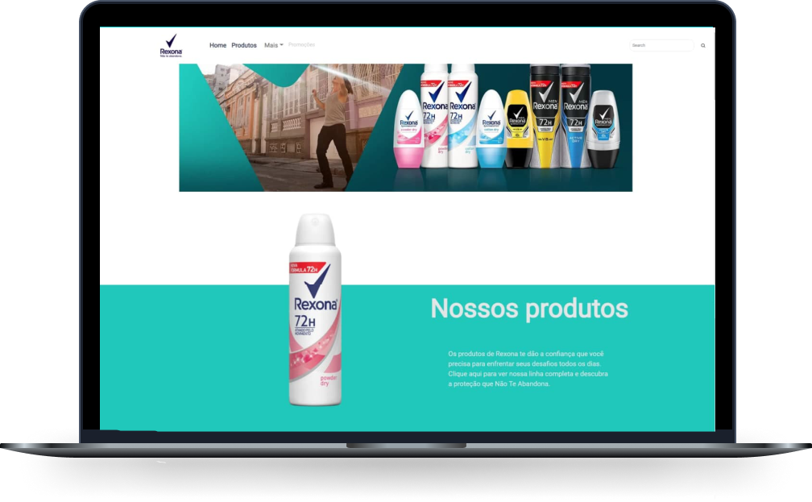
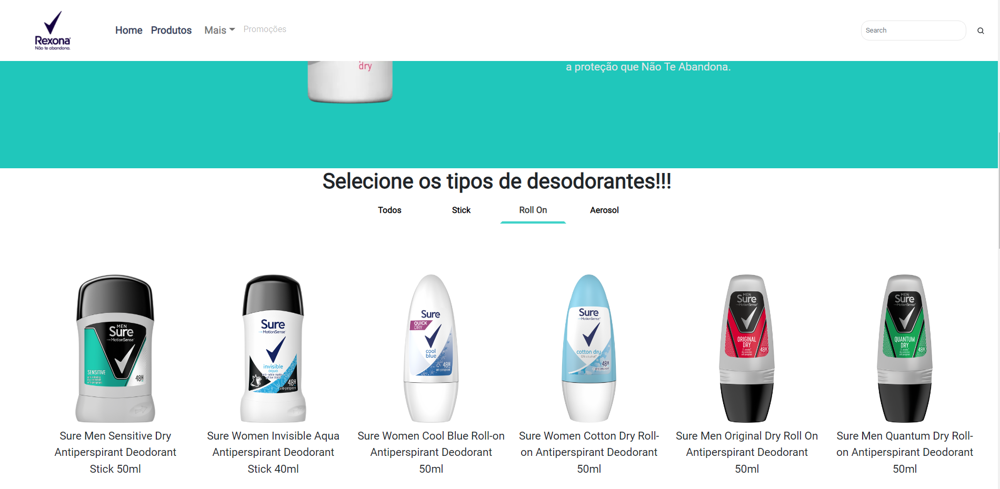
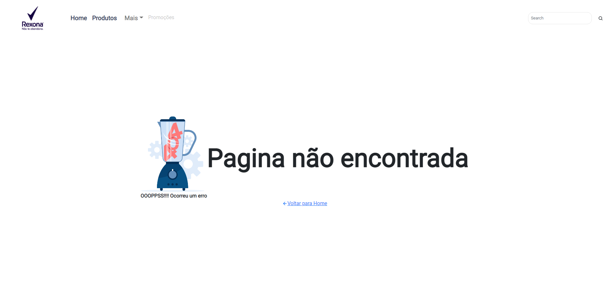
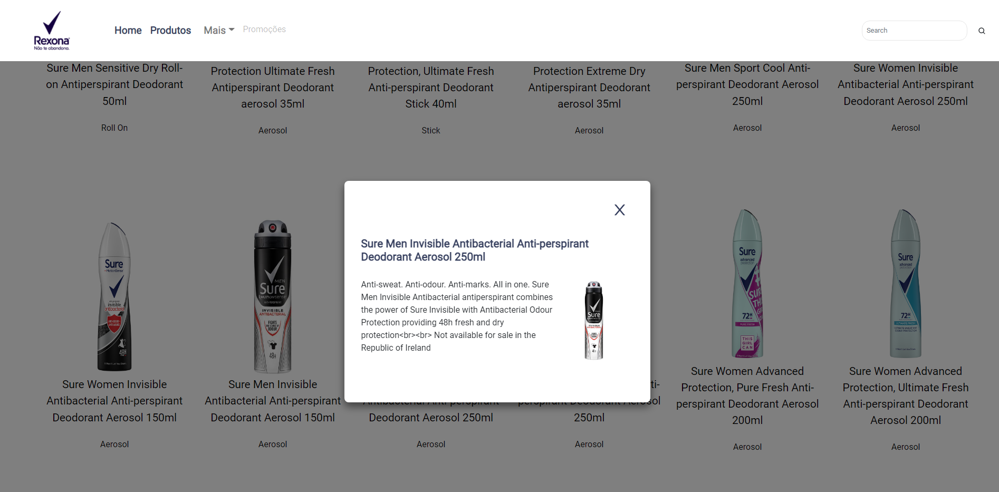
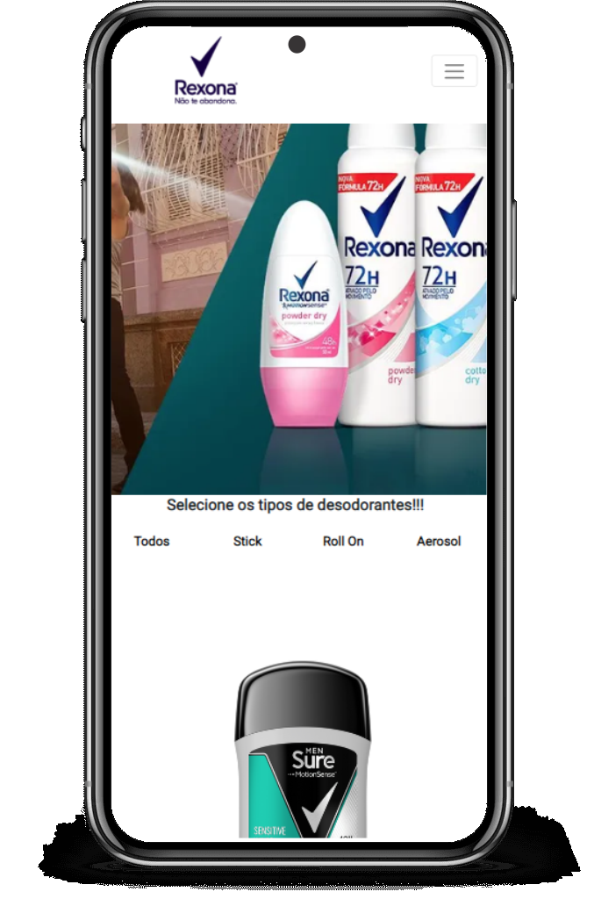
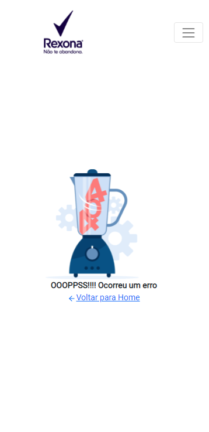
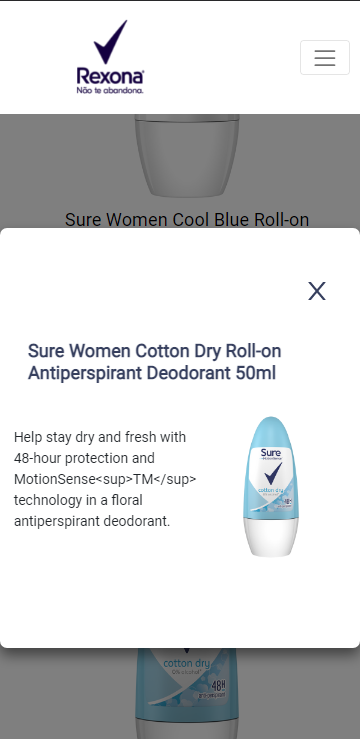

<p align="center">  Rexona Products 🚀</p>

<p align="center">
   
</p>

<p align="center">	
   <a href="https://www.linkedin.com/in/lorison-gilles/">
      
   </a>
  

  <a href="https://github.com/Gilles30/sure-rexona/commits/master">
    
  </a> 
  
  <a href="https://github.com/Gilles30/sure-rexona/stargazers">
    
  </a>
</p>

> <p align="center"> :rocket: Project created in carrying out a skill test with web development </p>

<p align="center">
    <a href="README.md">English</a>
    ·
    <a href="README-pt.md">Portuguese</a>
 </p>

<div align="center">
  <sub>The Products Rexona. Built with ❤︎ by
    <a href="https://github.com/Gilles30">Lorison Gilles</a> and
    <a href="https://github.com/Gilles30/sure-rexona/">
      contributors
    </a>
  </sub>
</div>

# :pushpin: Table of Contents

- [:pushpin: Table of Contents](#pushpin-table-of-contents)
    - [Web Screenshot](#web-screenshot)
    - [Mobile Screenshot](#mobile-screenshot)
- [:eyes: Demo Website](#eyes-demo-website)
- [:computer: Technologies](#computer-technologies)
- [:rocket: Features](#rocket-features)
- [:construction_worker: How to run](#construction_worker-how-to-run)
    - [📦 Run API](#-run-api)
    - [💻 Run Web Project](#-run-web-project)
- [:bug: Issues](#bug-issues)
- [:tada: Contributing](#tada-contributing)
  - [🤝 Contributing](#-contributing)
- [:closed_book: License](#closed_book-license)

</p>

### Web Screenshot

<div align="center">
   
   </br></br>
   
   </br></br>
   <p>
    Products are displayed on cards next to each other in a responsive way and can be filtered through their categories.
   </p>
   
   <p>
    The error screen was created, so that the user can have a better experience if there is an error on the pages (such as a route that does not exist), a small animation was placed in the central icon.
   </p>
   </br></br>
   
   <p>
    A modal with more item details was created. Clicking on the item's thistle opens the modal and can be closed by clicking outside the modal, clicking on the "close" button ( X ) and also pressing esc on your keyboard
   </p>
   
</div>
</br>

### Mobile Screenshot

<div align="center">
  
  </br></br>
   
   </br></br>
   
</div>

# :eyes: Demo Website

You can acess the website at:  
👉 demo:

[](https://sure-rexona.vercel.app/)

# :computer: Technologies

This project was made using the follow technologies:

- [Typescript](https://www.typescriptlang.org/)
- [Axios](https://axios-http.com/)
- [Prettier](https://prettier.io/)
- [React](https://reactjs.org/)
- [Styled-Components](https://www.styled-components.com/)
- [Json-server](https://github.com/typicode/json-server)
- [Reactstrap](https://reactstrap.github.io/?path=/story/home-installation--page)
- [Express](https://expressjs.com/)

# :rocket: Features

- Product listing.
- Filtering products by their category.
- Responsive layout.
- API created and deployed

# :construction_worker: How to run

```bash
# Clone Repository
$ git clone https://github.com/Gilles30/sure-rexona.git
```

### 📦 Run API

- API API consumed directly from the cloud!

```bash
# Routes and Endpoint
$ api-sure.herokuapp.com/data

# Object Typing
$ Data:{
  nodes
    {
      name: string,
      shortDescription: string
      id: string
      images:
        [
          {
            alt: string
            src: string
          }
        ]
      category:
        [
          name: string
          id: string
        ]
    }
  }
```

Access API at http://api-sure.herokuapp.com/data

### 💻 Run Web Project

```bash
# Go to web folder
$ cd products-rexona

# Install Dependencies (Only if you haven't installed the dependencies before)
$ yarn

# Run Aplication
$ yarn start

```

Go to http://localhost:3000

# :bug: Issues

Feel free to **file a new issue** with a respective title and description on the the [Proffy](https://github.com/Gilles30/sure-rexona/issues) repository. If you already found a solution to your problem, **i would love to review your pull request**!

# :tada: Contributing

Check out the [contributing](./CONTRIBUTING.md) page to see the best places to file issues, start discussions and begin contributing.

## 🤝 Contributing

Follow the steps below to contribute:

1.  _fork_ the project (<https://github.com/Gilles30/sure-rexona>)

2.  Clone your _fork_ to your machine (`git clone https://github.com/Gilles30/sure-rexona.git`)

3.  Create a _branch_ to carry out your modification (`git checkout -b feature/name_new_feature`)

4.  Add your modifications and do the _commit_ (`git commit -m "Descreva sua modificação"`)

5.  _Push_ (`git push origin feature/name_new_feature`)

6.  Create a new _Pull Request_

7.  Okay, now just wait for the analysis 🚀

# :closed_book: License

Released in 2022 :closed_book: License

Made with love by [Lorison Gilles](https://lorison-gilles.netlify.app/) 🚀.
This project is under the [MIT license](./LICENSE).

Give a ⭐️ if this project helped you!
